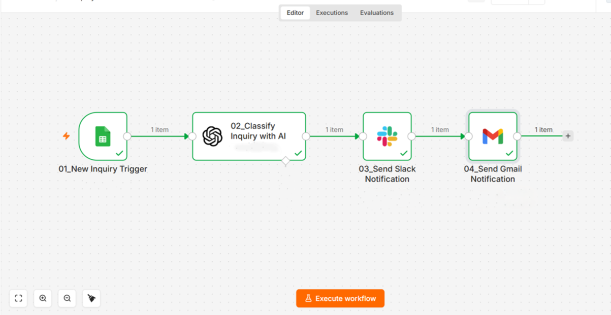
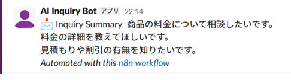

# AI Inquiry Summarization Workflow

AI-powered inquiry summarization workflow using n8n, OpenAI API, Google Sheets, Slack, and Gmail.

## Overview

This project is an AI-powered workflow automation system built with n8n and OpenAI API.

The workflow automatically summarizes inquiry content and sends automated notifications to Slack and Gmail.

---

## Workflow

Google Forms  
↓  
Google Sheets  
↓  
n8n Trigger  
↓  
OpenAI API  
↓  
AI Inquiry Summarization  
↓  
Slack Notification  
↓  
Gmail Notification

---

## Features

- AI inquiry summarization
- Slack notification automation
- Gmail notification automation
- OpenAI-powered workflow automation
- Faster inquiry handling workflow
- Automated information sharing

---

## Tech Stack

- n8n
- OpenAI API
- Google Sheets
- Google Forms
- Slack
- Gmail

---

## Screenshots

### Workflow Overview

### Slack Notification

---

## Use Cases

- Customer inquiry management
- AI-powered inquiry summaries
- Internal team notifications
- Faster information sharing
- Reducing manual inquiry review

---

## Future Improvements

- Sentiment analysis
- CRM integration
- AI-generated reply suggestions
- Priority classification
- Notion database integration
